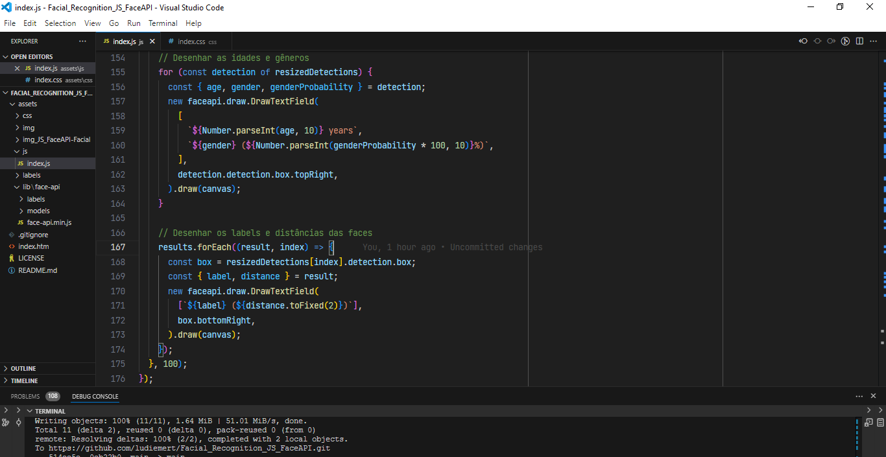
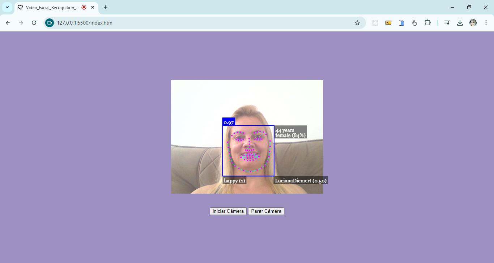

<h2 align="center"> 💻 Facial_Recognition_JS_FaceAPI </h2>
 

<h4 align="center"> 💻 Face Detection Project with face-api and JS
This project uses the face-api.js library to detect faces, facial landmarks, expressions, ages and genders from a video stream, using HTML, CSS and JavaScript.
All these features will be developed using the FaceAPI.js library </h4>
 

---
## Facial Recognition with Video Project
- This project uses the face-api.js library to implement a facial recognition system based on video captured from the device's camera. The application detects faces, identifies facial landmarks, emotions, age, and gender, and performs facial recognition using pre-trained descriptors. The interface includes buttons to start and stop the video, and the recognition process occurs in real-time.

---

<h4 align="center">Face Detection Project with face-api and JS 🚀</h4>

    
    

---

## Features
- Access the device's camera and display the video feed.
- Real-time facial recognition based on pre-loaded descriptors.
- Detection of facial landmarks, emotions, age, and gender.
- Display recognition information on a canvas overlaid on the video.
- Ability to start and stop the video using the "Start" and "Stop" buttons.

---

## Technologies Used
- JavaScript
- face-api.js: A library for facial recognition using neural networks.
- HTML/CSS: User interface with video and canvas for displaying detections.

---

## How It Works
1 -  Video Capture: The application requests access to the device’s camera. The video stream is displayed on the screen.

2- face-api.js Models: When the video starts, facial recognition models from face-api.js are loaded, including:

- Face detector (TinyFaceDetector).
- Facial landmark detector (faceLandmark68Net).
- Facial expression recognition (faceExpressionNet).
- Face recognition (faceRecognitionNet).
- Age and gender detection (ageGenderNet).
- SSD detector for higher accuracy (ssdMobilenetv1).

3 - Facial Recognition: Reference images are loaded to create facial descriptors that are used for comparison with the faces detected in the video.

4 - Drawing Results: Face detections, landmarks, expressions, age, and gender are drawn on a canvas overlaid on the video. The recognized person's name (or matching distance) and estimated age are also displayed.

---

## How to Run the Project
1 - Clone this repository: 
git clone (https://github.com/ludiemert/Facial_Recognition_JS_FaceAPI.git)
 
2 - Install any necessary dependencies (if applicable).

3 - Open the index.html file in your browser.

4 - Make sure to allow camera access when prompted.

---

## Code Structure
startVideo(): Starts the video stream by capturing from the camera and displaying it in the <video> element.
stopVideo(): Stops the video stream and hides the <video> element.
loadLabels(): Loads the reference images to create face descriptors for recognition.
Real-Time Recognition: A setInterval periodically runs face detection, landmarks, and facial expression recognition, drawing the results on the canvas.

---

## Dependencies
- face-api.js: JavaScript library for facial recognition.

---

## Models
- The neural network models used by face-api.js are loaded from the /assets/lib/face-api/models directory. Ensure that the model files are correctly placed in this path.
---
## License
- This project is licensed under the MIT License.
---

### 📦 Contribution

 - Feel free to contribute by submitting pull requests or reporting issues.

- #### My LinkedIn - 

#### Contact

#### [**Luciana Diemert**](https://github.com/ludiemert)

🛠 Full-Stack Developer  
🖥️ Python Enthusiast | Computer Vision | AI Integrations  
📍 São Jose dos Campos – SP, Brazil

&nbsp;
&nbsp;
&nbsp;
&nbsp;

 

